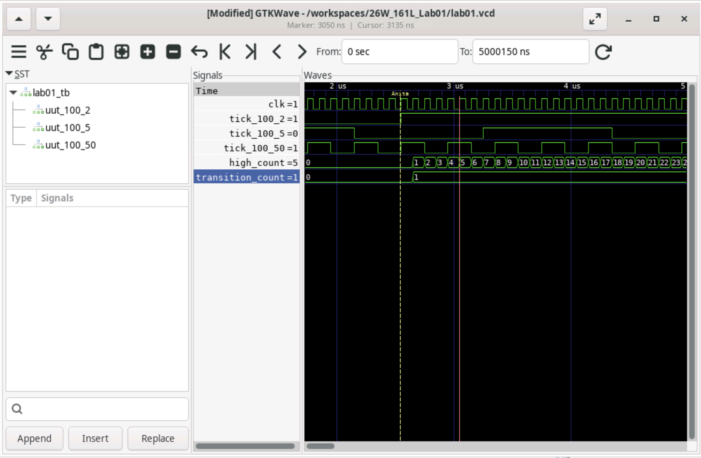

# Section 1
 ## Test Case 1
 This test case focuses on understanding the behavior fo the waveform when we modify the tick frequency to 5Hz. In comparison to the test case where we utilize 2Hz tick frequency, we see that the waveform alternates in smaller intervals.
 ## Test Case 2
 This test case focuses on understanding the behavior fo the waveform when we modify the tick frequency to 50Hz. In comparison to the test case where we utilize 2Hz and 5Hz tick frequency, we see that the waveform alternates in even smaller intervals.
# Section 2
 ## GTK Wave Screenshot
 

